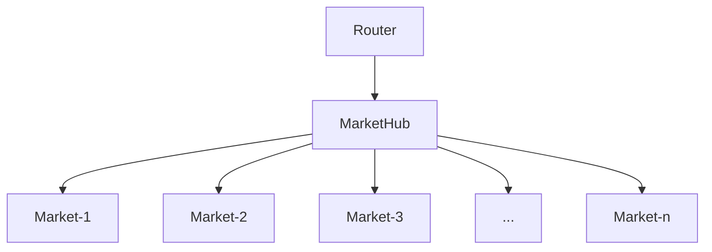

# Boros contract overall architecture

## Terms used in the codebase

This document lists the terms used in the Pendle Boros codebase. The terms are used as name of structs, types and variables.

- *Side* - The trade side. It can be either `LONG` or `SHORT`.
- *FIndex* - a structure consists of the following fields:
  - *fTime* - the timestamp.
  - *paymentIndex* - the payment index (or the _floating index_ in the whitepaper) corresponding to the *fTime*.
  - *feeIndex* - the fee index corresponding to the *fTime*.
  
  A new *FIndex* is calculated each time there is a new floating index, hence the name.

- *PayFee* - a pair of `payment` and `fee`. It is the result of the *Market*'s computation, returned to the *MarketHub* to update the collateral of the user.
- *Trade* - a pair of position `size` and annualized `cost`. Through out the computation process, trades can be combined into one, and then be used to update the user position `size`, as well as to calculate the up front fixed cost.
- *Account* - the entity representing the user. Its structure consists of the following fields:
  - *address* - the user address.
  - *accountId* - the id of the account. The `id` of 0 represents the **main** account, while the `id` of 1 to 255 are the **subaccounts**.
- *MarketAcc* - used to separate the position of an *Account* for each asset, for each market (_isolated_ margin type) or for all markets (_cross_ margin type).
- *Agent* - the _address_ that is allowed to perform an action on behalf of an user.
- *Cash* - the user's collateral. In the Boros system, cash can be _negative_ to denote up front borrow.

## Overview

The Pendle Boros system is a _closed_ system that consists of the following parts:

- *Market*: This is the component with the position swap and the order book system described in the whitepaper.
- *FIndex Oracle*: This is the oracle that is used by the Market to get the *FIndex* for user position calculation and settlement.
- *MarkRate Oracle*: This is the oracle that is used by the Market to get the mark rate for user payment and fees.
- *MarketHub*: This is where the information of **all** markets, as well as of **all** users, is handled, including:
    - The enter/exit market logic.
    - Cross market's margin calculation and check.
    - User account's collateral and position management.
    - Pausing.
    
    *MarketHub* is the only component that can interact with the *Market*s to perform state changes.
    
- *Router*: This component contains the logic for:
    - Agent authentication,
    - Message signing and verification,
    - Generating calls to the *MarketHub*.

Besides the above components, there are also the following components that can be seen as external:

- *AMM*: This component is introduced to support a subset of users that want to use Pendle Boros but do not want to use the OTC and order book system of the *Market*.
    - In the system, *AMM* is treated as a normal _account_ that can interact with the *Market*.

The relationship between the internal components can be seen as follows:

## Market

Market contains the logic to handle the user positions, as well as the orderbook with all the user orders.

Market will not contains the logic to move cash around. Instead, after its operations, the payment will be returned. MarketHub will use that information to pay the users and take fees.

Besides flexibility, each of the Market’s operations was written with efficiency in mind:

- Each operation has as much context as possible, but is still very flexible to compose in MarketHub and Router. For example, instead of an individual `removeOrders`, `placeOrders` and `otc` operations, it has `orderAndOtc` so that it can have more context inbetween processes.
- The operations were also written to be easily batched, allowing multiple orders to be processed at the same time.
- Common data, such as users data and market data, is loaded right at the beginning, and only got written back after a series of transformations.
- For order book, we have used data structure so that multiple orders can be matched quickly.
- Custom primitive types are used to make sure that storage read and write is done once for multiple packed fields.

## MarketHub

MarketHub consists of the following logics:
    - token transfers
    - account's cash and position management
    - market enter/exit.
    - margin checking, including cross-market margin calculation.
    - pausing.

Most of the *MarketHub*'s operations **mirror** *Market*'s operations. *MarketHub* will add additional cross-market checks, as well as performing cash transfer for each operation.

## Router

Router consists of the following main components:

- *Trade module*. This module allows the user to interact with the *MarketHub*, as well as with the AMM **directly**.
- *Auth module*. This module allows an account agent to perform an operation on behalf of the account owner. This module has additional logic for:
    - Agent authentication.
    - Action signature verification.
    - Action construction.
    - Action delegation to the *Trade module*.
- *AMM module*. This module has the logic specificly for AMM, such as add and remove liqiduity.

In the future, we have plan to support more operations by upgrading the `Router`. The following module are planned to be supported:
- *StopModule* - consists of the logic to allow the user to place stop loss/take profit orders.